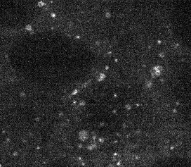

# Documentation for Users

A suggested way for using our toolkit is

(1) check out the lookup table and find an entry in the lookup table where the segmentation tasks is the most similar to yours;
(2) go to correspoinding Jupyter Notebook and follow the detailed instruction in the notebook to tune the workflow;
(3) After finalizing the algorithms and parameters in the workflow, modify batch_pipeline.py to batch process all data (file by file or folder by folder).


## Step 1: Find the entry in the lookup table with most similar morphology to your data


List of "playground":

1. playground_golgi.ipynb: workflow for Sialyltransferase 1
2. playground_fbl.ipynb: workflow for Fibrillarin
3. playground_npm1.ipynb: workflow for Nucleophosmin
4. playground_curvi.ipynb: workflows for Sec61 beta, Tom 20, Lamin B1 (mitosis-specific)
5. playground_lamp1.ipynb: workflow for LAMP-1
6. playground_dots.ipynb: workflows for Centrin-2, Desmoplakin, and PMP34
7. playground_gja1.ipynb: workflow for Connexin-43
8. playground_ctnnb1.ipynb: workflow for Beta catenin
9. playground_filament3d.ipynb: workflows for Tight junction protein ZO1, Beta actin, Non-muscle myosin IIB, Alpha-actinin-1, Alpha tubulin, Troponin I, and Titin
10. playground_shell.ipynb: workflow for Lamin B1 (Interphase-specific)

For example, you have Endosomes (Ras-related protein Rab-5A)



Visually, it has similar morphology as Peroxisomes (Peroxisomal membrane protein PMP34). The correspoinding Jupyter Notebook is playground_dots.ipynb

## Step 2: Go to the Jupyter Notebook and tune the workflow

First, start your Jupyter Notebook App.

```bash
source activate segmentation
cd PATH/TO/aics-segmentation/lookup_table_demo
jupyter notebook
```

(Note: change the conda environment name and github repository path accordingly)

Now, your Jupyter should have started in your default brower and you can open "playground_dots.ipynb

(A quick start guide on how executing a notebook can be found [here](https://jupyter-notebook-beginner-guide.readthedocs.io/en/latest/execute.html#executing-a-notebook))

Follow the instruct embedded in the notebook to tune the workflow for segmenting your images

## Step 3: build a batch processing scripts using the segmentation workflow you just tuned

If you need to consistently segment more than a few images similar to the one you just experimented with, you can easily build a batch processing program following the steps below.
