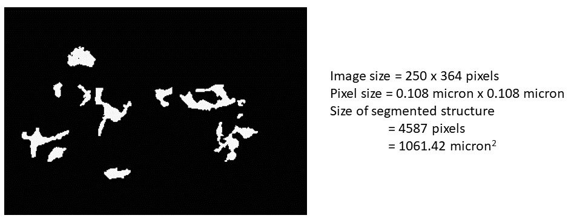
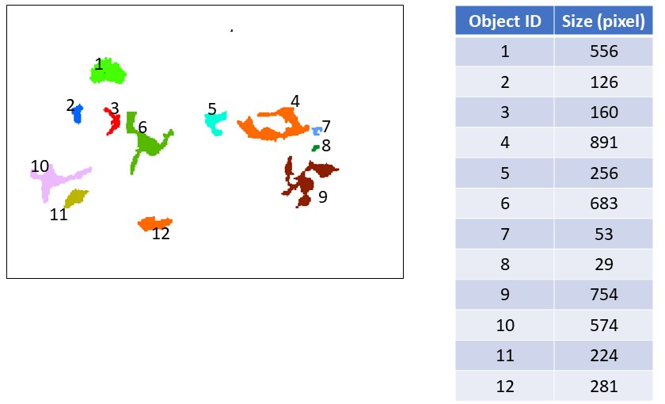
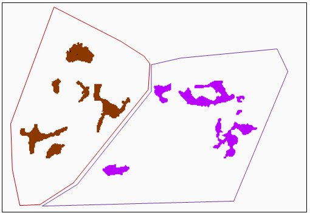
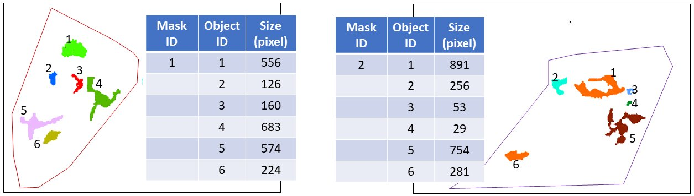

# What is object identification?

Suppose you have a multi-channel image with Golgi in one channel and plasma membrane in the another channel. One 2D z-slice of the 3D image is shown below.  

For simiplicity, to explain the concept of object identification, we use a small area (see the yellow box) for example. 

Suppose you have run the segmenter to get a binary image as the output as below. You can get some basic information, like how many pixels have been segmented as your target structure (i.e., Golgi) in this image or the physical size of structure in this whole image. 

A simple way of **object identification**  is to extract each [connected component](https://homepages.inf.ed.ac.uk/rbf/HIPR2/label.htm) and define each connected component as one object. 

Furthermore, you can also convert the binary image into separated groups of analyzable objects according to **mask labels**.

What is a mask label? Depending on the biological questions, the mask label may vary. It could be areas enclosed by each individual cell or each individual nucleus, or any other way you may want to partition the image into different analyzable regions. All the objects in one particular cell/nucleus/customized region within in the structure segmentation binary image would have the same group id. 

This is useful, for example, when a per-cell measurement is needed. In this case a cell segmentation is used as the mask label.

*Note: In this demo, we are using a cell segmentation generated by a deep learning based segmentation algorithm developed at the Allen Institute for Cell Science. We are working on the release of our nuclear/cell segmentation workflows. Please stay tuned :) For your data, you may use your own nuclear/cell segmentation approach or you can do this via manual annotation in Fiji.*

In this example, when we apply the cell segmentation as the mask label, we have: 

Then, we can get the object identification results as below. 

