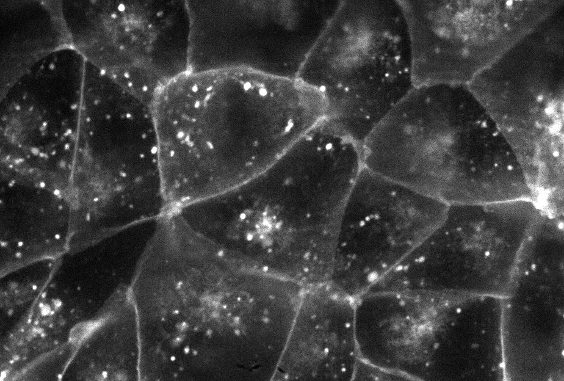
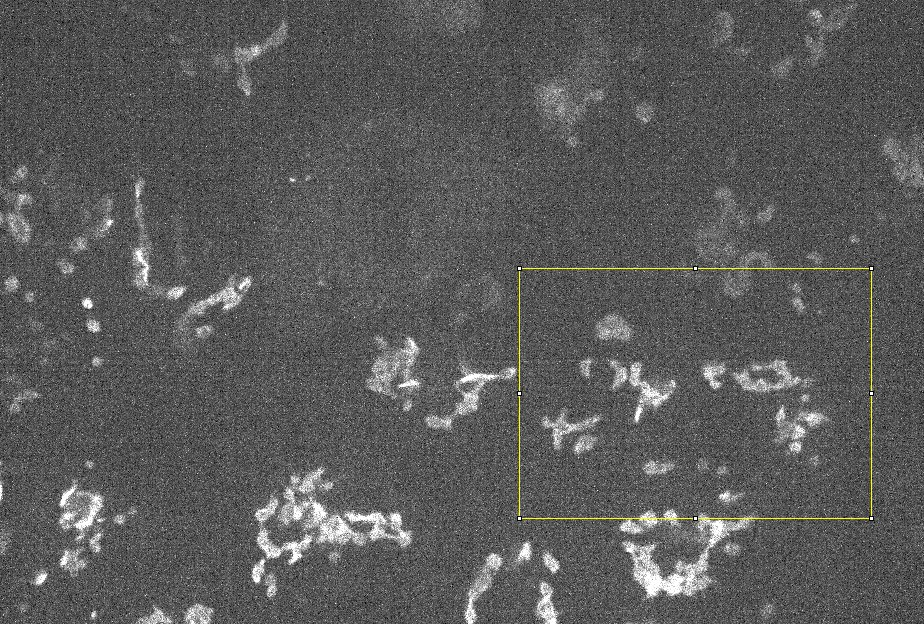

# What is object identification?

Suppose you have a multi-channel image with Golgi in one channel and plasma membrane in the another channel. One 2D z-slice of the 3D image is shown below.  

For simiplicity, to explain the concept of object identification, we use a small area (see the yellow box) for example. 